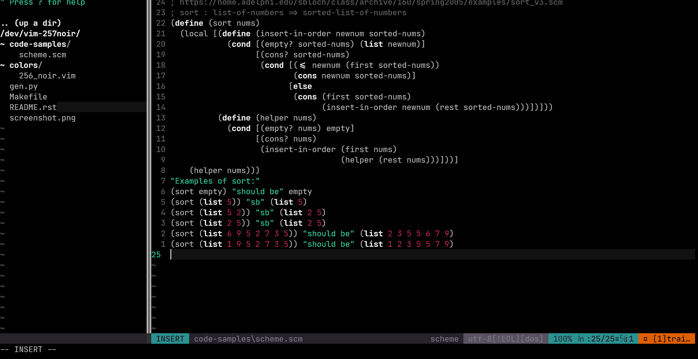

# vim-257noir

A fork of [vim-256noir](https://github.com/andreasvc/vim-256noir) with some subtle tweaks for GUI mode.



For more info, check the README for the [original repo](https://github.com/andreasvc/vim-256noir).

## Usage
1. Install using your package manager of choice (I'm using vim-plug).
```vim
Plug 'srijan-paul/vim-257noir'
```
2. Set the color theme:
```vim
colo 257_noir
```

## Changes
- Keywords are bold.
- Strings are a shade of green (#34c99a).
- Numbers are a subtler shade of red (#c4295d).
